# Bearbeitung von Lastgangdaten mit Codelos.io restful APIs

## 1. Einführung

   ### 1. 1. Codelos.io Restful APIs für Energiewirtschaft

Codelos.io bietet eine Reihe von Funktionalitäten für Entwickler in der Enenrgiewirtschaft. Diese ermöglichen es, dass Entwickler sich auf die Kernfunktionalitäten deren Produkten zu fokusieren und eine Menge Zeit und Geld zu sparen.

Weitere Infos über die Restful APIs von Codelos.io finden Sie unter:<br>
https://developper.codelos.io

Die Dokumentation zu diese APIs finden Sie unter:<br>
https://developper.codelos.io/doku

Um direkt loszulegen können Sie die Code-beispiele für die folgende Programmiersprachen nutzen:
* [Python](https://developper.codelos.io/doku)
* [PHP](https://developper.codelos.io/doku)
* [Javascript](https://developper.codelos.io/doku)
* [Java](https://developper.codelos.io/doku)

Diese Doku plus weitere nutzliche Inhalte für Entwickler finden Sie unter:<br>
https://github.com

   ### 1. 2.  Authentifizierung

Authentification nach oAuth methode, mit Benutzername und Passwort:


```python
# API end point
api_endpoint = 'http://127.0.0.1:1880'
function = 'oauth/token'

# credencials
params = '?username={}&password={}'.format(urllib.parse.quote('louqmane@gharnati.com'), urllib.parse.quote('Start-123'))

# call oauth
url = api_endpoint + '/' + function + params 
response = requests.get(url )
```

Die Funktion ```oauth/auth``` gibt einen Bearer Token zurück der in den weiteren Aufrufen der Funktion verwendet werden kann.


```python
# token
token = json.loads(response.text)
token
```


    'eyJraWQiOiI5M2NHeEY5dHhINTl2SWJpVDR1NDZQQ0VvOFNGZ2xEdno5THg1UVRcL2k3Yz0iLCJhbGciOiJSUzI1NiJ9.eyJzdWIiOiJjOWRmNTUzMC0zOGQ3LTQzMTEtODM5Zi00OThmNTMzZDU0ZmYiLCJldmVudF9pZCI6ImI0YWQzZDFiLTAyN2QtNDVmZi1iY2EyLWU2M2Y0Yzk4NmRhOCIsInRva2VuX3VzZSI6ImFjY2VzcyIsInNjb3BlIjoiYXdzLmNvZ25pdG8uc2lnbmluLnVzZXIuYWRtaW4iLCJhdXRoX3RpbWUiOjE1OTY3MzExMjcsImlzcyI6Imh0dHBzOlwvXC9jb2duaXRvLWlkcC5ldS1jZW50cmFsLTEuYW1hem9uYXdzLmNvbVwvZXUtY2VudHJhbC0xX25lNjBzOURReSIsImV4cCI6MTU5NjczNDcyNywiaWF0IjoxNTk2NzMxMTI3LCJqdGkiOiJhZGZhN2ZjYy1kZjAxLTQyMjItYTdmOC1kM2RmMDA3YmMzODUiLCJjbGllbnRfaWQiOiIzcnNqdGJ0c2YyYnY1ZjE4N2Q5OTg5ZDJzbCIsInVzZXJuYW1lIjoiYzlkZjU1MzAtMzhkNy00MzExLTgzOWYtNDk4ZjUzM2Q1NGZmIn0.G6YcLrQCUj_JDR2JtNhvvuI5fXt8i6Y7TE1ee-iKqA3IF6lAFMXtUOYn7hepDkLDiXsUKx4SPBoDUPZFNZqPgdDD7mL_edzsQfqAwACWEWLvfgweNht8hEF-gomUOLNCbC4zd-Yr_zqWxgSehp1eDEi5bo8jXf0j3Qr3InyiVWmEVePw-vA8dNk8coy3JyMi27qeHyh5gGTgBaoh9NwVxSYPfDdixny3CXSVfMFA0uWrL1jmvaQLGF1i5Q5Hb7JfiY4FuG1r2lyNVK4nU60NHbcq9nLsz3fU_k2VZqYYJjvNHHuMhy8TQtltk4TWNtrVyLpL9wkfgAby--CUHVA61Q'


   ### 1. 3.  Loslegen mit dem ersten Aufruf

In dem folgeden Code_Beipiel werden wir mit der funktion ```parse``` der API einen Lastgang aus einer csv Datei einlesen und als JSOn zurückgeben.


```python
# parse load curve function
function = 'parse'
url = api_endpoint + '/' + function

# get file
filepath= 'assets/csv/get_started.csv'
with open(filepath) as fp:
    file_data = fp.read()
    file = {'file': ('file.csv', file_data,'text/csv')}

#call
rslt = requests.post(url = url, data ={'token' : token, 'response_format' : 'json', 'file': 'file.csv',}, files = file )
```

JSON response in eine dataframe einlesen und ausgeben


```python
# read json
jsn = json.loads(json.loads(rslt.text))
df = pd.DataFrame(jsn[0]['data'])
df[0] = pd.to_datetime(df[0],unit='ms')

# name columns and print
df.columns= ['datetime', 'value']

# print
df.head(15)
```


<div>

<table border="1" class="dataframe">
  <thead>
    <tr style="text-align: right;">
      <th></th>
      <th>datetime</th>
      <th>value</th>
    </tr>
  </thead>
  <tbody>
    <tr>
      <td>0</td>
      <td>2012-01-01 01:00:00</td>
      <td>396.0</td>
    </tr>
    <tr>
      <td>1</td>
      <td>2012-01-02 01:00:00</td>
      <td>474.0</td>
    </tr>
    <tr>
      <td>2</td>
      <td>2012-01-03 01:00:00</td>
      <td>463.0</td>
    </tr>
    <tr>
      <td>3</td>
      <td>2012-01-04 01:00:00</td>
      <td>492.0</td>
    </tr>
    <tr>
      <td>4</td>
      <td>2012-01-05 01:00:00</td>
      <td>511.0</td>
    </tr>
    <tr>
      <td>5</td>
      <td>2012-01-06 01:00:00</td>
      <td>509.0</td>
    </tr>
    <tr>
      <td>6</td>
      <td>2012-01-07 01:00:00</td>
      <td>487.0</td>
    </tr>
    <tr>
      <td>7</td>
      <td>2012-01-08 01:00:00</td>
      <td>482.0</td>
    </tr>
    <tr>
      <td>8</td>
      <td>2012-01-09 01:00:00</td>
      <td>523.0</td>
    </tr>
    <tr>
      <td>9</td>
      <td>2012-01-10 01:00:00</td>
      <td>535.0</td>
    </tr>
    <tr>
      <td>10</td>
      <td>2012-01-11 01:00:00</td>
      <td>501.0</td>
    </tr>
    <tr>
      <td>11</td>
      <td>2012-01-12 01:00:00</td>
      <td>499.0</td>
    </tr>
    <tr>
      <td>12</td>
      <td>2012-01-13 01:00:00</td>
      <td>558.0</td>
    </tr>
    <tr>
      <td>13</td>
      <td>2012-01-14 01:00:00</td>
      <td>500.0</td>
    </tr>
    <tr>
      <td>14</td>
      <td>2012-01-15 01:00:00</td>
      <td>524.0</td>
    </tr>
  </tbody>
</table>
</div>


Wir packen den Code in einer Funktion und fügen weitere Optionen für die nächsten Beispiele in der Doku


```python
def parse(path, fix_time_stamps= True, get_meta = True, fill_missing_values='no_fill', plot=False):
    # parse load curve function
    function = 'parse'
    url = api_endpoint + '/' + function

    # get file
    with open(filepath) as fp:
        file_data = fp.read()
        file = {'file': ('file.csv', file_data,'text/csv')}

    #call
    rslt = requests.post(url = url, data ={'token' : token, 'file': 'file.csv', 'force_read' : fix_time_stamps, 'fill_missing_values': fill_missing_values}, files = file )

    #check http error responses
    if rslt.status_code != 200:
        print (rslt.status_code, rslt.reason, rslt.text)
    else:
        if get_meta:
            # read meta data
            meta_data = json.loads(json.loads(rslt.text))
            del meta_data[0]['data'] 
            print(json.dumps(meta_data[0], indent=4, sort_keys=True))

        #read time series
        jsn = json.loads(json.loads(rslt.text))
        df = pd.DataFrame(jsn[0]['data'])
        df[0] = pd.to_datetime(df[0],unit='ms')

        # name columns and print
        df.columns= ['datetime', 'value']
        if plot:
            df.plot(x='datetime')
        else:
            print (df.head(30))
```

## 2. Lastgang-zeitreihen erkennen und einlesen

### 2. 1. Zeitreihe lokalisieren

Beispiel:
Der Lastgang unten ist ein Typische Beispiel von eine Lastgang-Datei wo die Werte nicht direkt in der ersten Zeilen/Spalten zu finden sind. 

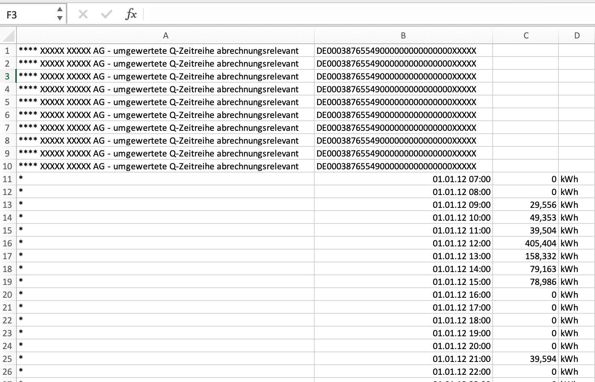

Die API-Funktion ```/parse``` sucht den ersten Zeitstempel in der Datei, überprüft ob es sich um eine zeitreihe handelt und dann liest die Werte.

Darüber hinaus berechnet die Funktion die Kennzahlen des Lastgangs. 


```python
parse(filepath)
```

    {
        "avr": 370.13698630136986,
        "begin": null,
        "end": null,
        "freq": "D",
        "max": 890.0,
        "name": "file",
        "sum": 135100.0,
        "unit": null
    }
                  datetime  value
    0  2012-01-01 01:00:00  396.0
    1  2012-01-02 01:00:00  474.0
    2  2012-01-03 01:00:00  463.0
    3  2012-01-04 01:00:00  492.0
    4  2012-01-05 01:00:00  511.0
    5  2012-01-06 01:00:00  509.0
    6  2012-01-07 01:00:00  487.0
    7  2012-01-08 01:00:00  482.0
    8  2012-01-09 01:00:00  523.0
    9  2012-01-10 01:00:00  535.0
    10 2012-01-11 01:00:00  501.0
    11 2012-01-12 01:00:00  499.0
    12 2012-01-13 01:00:00  558.0
    13 2012-01-14 01:00:00  500.0
    14 2012-01-15 01:00:00  524.0
    15 2012-01-16 01:00:00  645.0
    16 2012-01-17 01:00:00  662.0
    17 2012-01-18 01:00:00  653.0
    18 2012-01-19 01:00:00  593.0
    19 2012-01-20 01:00:00  626.0
    20 2012-01-21 01:00:00  522.0
    21 2012-01-22 01:00:00  546.0
    22 2012-01-23 01:00:00  596.0
    23 2012-01-24 01:00:00  595.0
    24 2012-01-25 01:00:00  631.0
    25 2012-01-26 01:00:00  621.0
    26 2012-01-27 01:00:00  594.0
    27 2012-01-28 01:00:00  581.0
    28 2012-01-29 01:00:00  608.0
    29 2012-01-30 01:00:00  636.0


### 2. 2. Unterschiedlicher Zeitstämpel-Formate erkennen und einlesen

In den folgenden Beispiele sieht man unterschiedliche Zeitstempel-formate für Lastgänge. In der Praxis tauchen sehr viele Formate auf. Dies sind immer von herkunft der Daten abhängig.

Unterschiedliche EDMs nutzen unterschiedliche Export-Formate. Daten die direkt aus einer Datenbank exportiert wurden können wiederum auch andere Formate haben.

Darüberhinaus werde Lastgangdaten öffter mit excel geöfnet oder verarbeitet manchmal unbemerkt die Formate ändert.


```python
get_screen_shots('differente_date_formats', 7)
```


<tr><td>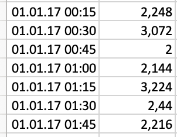</td><td>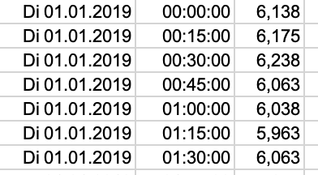</td><td>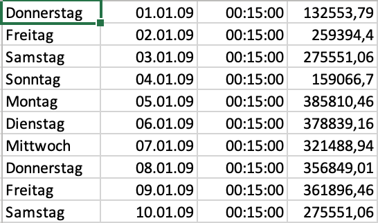</td></tr><tr><td>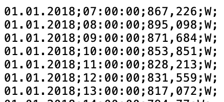</td><td>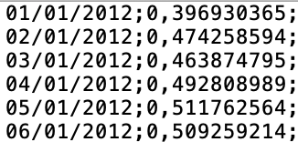</td><td>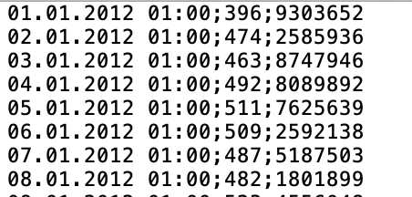</td></tr><tr><td></td>


Das Parser API kann mehr als 150 unterschiedliche Datumsformate erkennen und korrekt einlesen.


```python
# get all date formats from api
get_accepted_date_formats('01.01.2020 01:00')
```

    01.01.2020
    01/01/2020
    01/01/2020
    2020-01-01
    01. Januar 2020
    01. Jan 2020
    01.01.20
    01/01/20
    01/01/20
    20-01-01
    Mi 01.01.2020
    Mi 01/01/2020
    Mi 01/01/2020
    Mi 2020-01-01
    Mi 01. Januar 2020
    Mi 01. Jan 2020
    Mi 01.01.20
    Mi 01/01/20
    Mi 01/01/20
    Mi 20-01-01
    Mi, 01.01.2020
    Mi, 01/01/2020
    Mi, 01/01/2020
    Mi, 2020-01-01
    Mi, 01. Januar 2020
    Mi, 01. Jan 2020
    Mi, 01.01.20
    Mi, 01/01/20
    Mi, 01/01/20
    Mi, 20-01-01
    Mittwoch 01.01.2020
    Mittwoch 01/01/2020
    Mittwoch 01/01/2020
    Mittwoch 2020-01-01
    Mittwoch 01. Januar 2020
    Mittwoch 01. Jan 2020
    Mittwoch 01.01.20
    Mittwoch 01/01/20
    Mittwoch 01/01/20
    Mittwoch 20-01-01
    Mittwoch, 01.01.2020
    Mittwoch, 01/01/2020
    Mittwoch, 01/01/2020
    Mittwoch, 2020-01-01
    Mittwoch, 01. Januar 2020
    Mittwoch, 01. Jan 2020
    Mittwoch, 01.01.20
    Mittwoch, 01/01/20
    Mittwoch, 01/01/20
    Mittwoch, 20-01-01
    01.01.2020 01:00:00
    01.01.2020 01:00
    01/01/2020 01:00:00
    01/01/2020 01:00
    01/01/2020 01:00:00
    01/01/2020 01:00
    2020-01-01 01:00:00
    2020-01-01 01:00
    01. Januar 2020 01:00:00
    01. Januar 2020 01:00
    01. Jan 2020 01:00:00
    01. Jan 2020 01:00
    01.01.20 01:00:00
    01.01.20 01:00
    01/01/20 01:00:00
    01/01/20 01:00
    01/01/20 01:00:00
    01/01/20 01:00
    20-01-01 01:00:00
    20-01-01 01:00
    Mi 01.01.2020 01:00:00
    Mi 01.01.2020 01:00
    Mi 01/01/2020 01:00:00
    Mi 01/01/2020 01:00
    Mi 01/01/2020 01:00:00
    Mi 01/01/2020 01:00
    Mi 2020-01-01 01:00:00
    Mi 2020-01-01 01:00
    Mi 01. Januar 2020 01:00:00
    Mi 01. Januar 2020 01:00
    Mi 01. Jan 2020 01:00:00
    Mi 01. Jan 2020 01:00
    Mi 01.01.20 01:00:00
    Mi 01.01.20 01:00
    Mi 01/01/20 01:00:00
    Mi 01/01/20 01:00
    Mi 01/01/20 01:00:00
    Mi 01/01/20 01:00
    Mi 20-01-01 01:00:00
    Mi 20-01-01 01:00
    Mi, 01.01.2020 01:00:00
    Mi, 01.01.2020 01:00
    Mi, 01/01/2020 01:00:00
    Mi, 01/01/2020 01:00
    Mi, 01/01/2020 01:00:00
    Mi, 01/01/2020 01:00
    Mi, 2020-01-01 01:00:00
    Mi, 2020-01-01 01:00
    Mi, 01. Januar 2020 01:00:00
    Mi, 01. Januar 2020 01:00
    Mi, 01. Jan 2020 01:00:00
    Mi, 01. Jan 2020 01:00
    Mi, 01.01.20 01:00:00
    Mi, 01.01.20 01:00
    Mi, 01/01/20 01:00:00
    Mi, 01/01/20 01:00
    Mi, 01/01/20 01:00:00
    Mi, 01/01/20 01:00
    Mi, 20-01-01 01:00:00
    Mi, 20-01-01 01:00
    Mittwoch 01.01.2020 01:00:00
    Mittwoch 01.01.2020 01:00
    Mittwoch 01/01/2020 01:00:00
    Mittwoch 01/01/2020 01:00
    Mittwoch 01/01/2020 01:00:00
    Mittwoch 01/01/2020 01:00
    Mittwoch 2020-01-01 01:00:00
    Mittwoch 2020-01-01 01:00
    Mittwoch 01. Januar 2020 01:00:00
    Mittwoch 01. Januar 2020 01:00
    Mittwoch 01. Jan 2020 01:00:00
    Mittwoch 01. Jan 2020 01:00
    Mittwoch 01.01.20 01:00:00
    Mittwoch 01.01.20 01:00
    Mittwoch 01/01/20 01:00:00
    Mittwoch 01/01/20 01:00
    Mittwoch 01/01/20 01:00:00
    Mittwoch 01/01/20 01:00
    Mittwoch 20-01-01 01:00:00
    Mittwoch 20-01-01 01:00
    Mittwoch, 01.01.2020 01:00:00
    Mittwoch, 01.01.2020 01:00
    Mittwoch, 01/01/2020 01:00:00
    Mittwoch, 01/01/2020 01:00
    Mittwoch, 01/01/2020 01:00:00
    Mittwoch, 01/01/2020 01:00
    Mittwoch, 2020-01-01 01:00:00
    Mittwoch, 2020-01-01 01:00
    Mittwoch, 01. Januar 2020 01:00:00
    Mittwoch, 01. Januar 2020 01:00
    Mittwoch, 01. Jan 2020 01:00:00
    Mittwoch, 01. Jan 2020 01:00
    Mittwoch, 01.01.20 01:00:00
    Mittwoch, 01.01.20 01:00
    Mittwoch, 01/01/20 01:00:00
    Mittwoch, 01/01/20 01:00
    Mittwoch, 01/01/20 01:00:00
    Mittwoch, 01/01/20 01:00
    Mittwoch, 20-01-01 01:00:00
    Mittwoch, 20-01-01 01:00


### 2.2. Leerzeichen, leehre Spalten und Zeilen korrigieren

Beipiele:


```python
get_screen_shots('white spaces', 4)
```


<tr><td></td><td></td><td></td></tr><tr><td></td>


### 2.3. Kleine menschlichen Fehlern korrigieren

Beipiele:


```python
get_screen_shots('human_errors', 1)
```


<tr><td>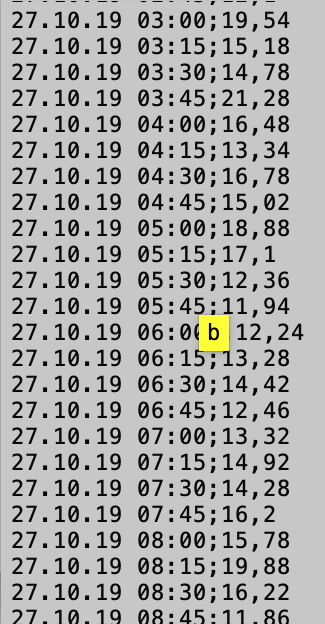</td>


## 3. Lastgang-Zeitreihe überprüfen und bei Bedarf Korrigieren und ergänzen

### 3.1. Zeitsempel nach Konsistenz überprüfen

Der Lastgang muss einen kontinuierlichen und eindeutigen Zeitstempel haben. Der Zeitstempel-Interval muss über den gesamten Zeitraum konsistenz sein (täglich, stündlich, viertelstündlich).

Bei Inkonsitenz gibt es drei Szenarien:

Szenario 1: Format-bezogene Inkonsitenzen werden automatisch behoben


```python
filepath = "assets/csv/6.csv"
df = pd.read_csv(filepath, header=None, delimiter=';')
df
```


<div>

<table border="1" class="dataframe">
  <thead>
    <tr style="text-align: right;">
      <th></th>
      <th>0</th>
      <th>1</th>
    </tr>
  </thead>
  <tbody>
    <tr>
      <td>0</td>
      <td>28.10.19 01:00</td>
      <td>13,14</td>
    </tr>
    <tr>
      <td>1</td>
      <td>28.10.19 01:15</td>
      <td>11,7</td>
    </tr>
    <tr>
      <td>2</td>
      <td>28.10.19 01:30</td>
      <td>12,26</td>
    </tr>
    <tr>
      <td>3</td>
      <td>28.10.19 01:45</td>
      <td>13,04</td>
    </tr>
    <tr>
      <td>4</td>
      <td>28.10.19 02:00</td>
      <td>12,6</td>
    </tr>
    <tr>
      <td>5</td>
      <td>28.10.19 02:15</td>
      <td>12,2</td>
    </tr>
    <tr>
      <td>6</td>
      <td>28.10.19 02:30</td>
      <td>12,96</td>
    </tr>
    <tr>
      <td>7</td>
      <td>28.10.19 02:45</td>
      <td>19,08</td>
    </tr>
    <tr>
      <td>8</td>
      <td>28.10.19 03:00</td>
      <td>16,22</td>
    </tr>
    <tr>
      <td>9</td>
      <td>28.10.19 02:15 s</td>
      <td>13,38</td>
    </tr>
    <tr>
      <td>10</td>
      <td>28.10.2019 02:30:00 s</td>
      <td>13,88</td>
    </tr>
    <tr>
      <td>11</td>
      <td>28.10.2019 02:45:00 s</td>
      <td>13,94</td>
    </tr>
    <tr>
      <td>12</td>
      <td>28.10.2019 03:00:00 s</td>
      <td>12,36</td>
    </tr>
    <tr>
      <td>13</td>
      <td>28.10.19 03:15</td>
      <td>11,36</td>
    </tr>
    <tr>
      <td>14</td>
      <td>28.10.19 03:30</td>
      <td>11,52</td>
    </tr>
    <tr>
      <td>15</td>
      <td>28.10.19 03:45</td>
      <td>11,84</td>
    </tr>
    <tr>
      <td>16</td>
      <td>28.10.19 04:00</td>
      <td>11,5</td>
    </tr>
    <tr>
      <td>17</td>
      <td>28.10.19 04:15</td>
      <td>11,28</td>
    </tr>
    <tr>
      <td>18</td>
      <td>28.10.19 04:30</td>
      <td>14,42</td>
    </tr>
  </tbody>
</table>
</div>


```python
parse(path = filepath, get_meta = False)
```

                  datetime  value
    0  2019-10-28 01:00:00  13.14
    1  2019-10-28 01:15:00  11.70
    2  2019-10-28 01:30:00  12.26
    3  2019-10-28 01:45:00  13.04
    4  2019-10-28 02:00:00  12.60
    5  2019-10-28 02:15:00  12.20
    6  2019-10-28 02:30:00  12.96
    7  2019-10-28 02:45:00  19.08
    8  2019-10-28 03:00:00  16.22
    9  2019-10-28 03:15:00  13.38
    10 2019-10-28 03:30:00  13.88
    11 2019-10-28 03:45:00  13.94
    12 2019-10-28 04:00:00  12.36
    13 2019-10-28 04:15:00  11.36
    14 2019-10-28 04:30:00  11.52
    15 2019-10-28 04:45:00  11.84
    16 2019-10-28 05:00:00  11.50
    17 2019-10-28 05:15:00  11.28


Szenario 2: die Inkonsistenz im Zeitstempel ist kein Format-fehler und der die Option "force read" ist auf "False" gesetzt.

In diesem fall wir ein Fehler ausgegeben.


```python
filepath = "assets/csv/7.csv"
df = pd.read_csv(filepath, header=None, delimiter=';')
df.head(15)
```


<div>

<table border="1" class="dataframe">
  <thead>
    <tr style="text-align: right;">
      <th></th>
      <th>0</th>
      <th>1</th>
    </tr>
  </thead>
  <tbody>
    <tr>
      <td>0</td>
      <td>28.10.19 01:00</td>
      <td>13,14</td>
    </tr>
    <tr>
      <td>1</td>
      <td>28.10.19 01:15</td>
      <td>11,7</td>
    </tr>
    <tr>
      <td>2</td>
      <td>28.10.19 01:30</td>
      <td>12,26</td>
    </tr>
    <tr>
      <td>3</td>
      <td>28.10.19 01:45</td>
      <td>13,04</td>
    </tr>
    <tr>
      <td>4</td>
      <td>28.10.19 02:00</td>
      <td>12,6</td>
    </tr>
    <tr>
      <td>5</td>
      <td>28.10.19 02:15</td>
      <td>12,2</td>
    </tr>
    <tr>
      <td>6</td>
      <td>28.10.19 02:30</td>
      <td>12,96</td>
    </tr>
    <tr>
      <td>7</td>
      <td>28.10.19 02:45</td>
      <td>19,08</td>
    </tr>
    <tr>
      <td>8</td>
      <td>28.10.19 03:00</td>
      <td>16,22</td>
    </tr>
    <tr>
      <td>9</td>
      <td>28.10.2019</td>
      <td>13,38</td>
    </tr>
    <tr>
      <td>10</td>
      <td>28.10.2019</td>
      <td>13,88</td>
    </tr>
    <tr>
      <td>11</td>
      <td>28.10.2019</td>
      <td>13,94</td>
    </tr>
    <tr>
      <td>12</td>
      <td>28.10.2019</td>
      <td>12,36</td>
    </tr>
    <tr>
      <td>13</td>
      <td>28.10.19 03:15</td>
      <td>11,36</td>
    </tr>
    <tr>
      <td>14</td>
      <td>28.10.19 03:30</td>
      <td>11,52</td>
    </tr>
  </tbody>
</table>
</div>


```python
parse(path = filepath, fix_time_stamps= False, get_meta = False)
```

    500 INTERNAL SERVER ERROR <!DOCTYPE HTML PUBLIC "-//W3C//DTD HTML 3.2 Final//EN">
    <title>500 Internal Server Error</title>
    <h1>Internal Server Error</h1>
    <p>The server encountered an internal error and was unable to complete your request. Either the server is overloaded or there is an error in the application.</p>
    


Szenario 3: die Inkonsistenz im Zeitstempel ist kein Format-fehler und der die Option "force read" ist auf "True" gesetzt.

In diesem fall wir zeitstempel korrigiert/ersetzt.


```python
parse(path = filepath, fix_time_stamps= True, get_meta = False)
```

                  datetime  value
    0  2019-10-28 01:00:00  13.14
    1  2019-10-28 01:15:00  11.70
    2  2019-10-28 01:30:00  12.26
    3  2019-10-28 01:45:00  13.04
    4  2019-10-28 02:00:00  12.60
    5  2019-10-28 02:15:00  12.20
    6  2019-10-28 02:30:00  12.96
    7  2019-10-28 02:45:00  19.08
    8  2019-10-28 03:00:00  16.22
    9  2019-10-28 03:15:00  13.38
    10 2019-10-28 03:30:00  13.88
    11 2019-10-28 03:45:00  13.94
    12 2019-10-28 04:00:00  12.36
    13 2019-10-28 04:15:00  11.36
    14 2019-10-28 04:30:00  11.52
    15 2019-10-28 04:45:00  11.84
    16 2019-10-28 05:00:00  11.50
    17 2019-10-28 05:15:00  11.28


### 3. 2. Zeitreihe nach Vollständigkeit überprüfen

#### 3. 2. 1. Zeitstempel

Die Messwerte im Lastgang dürfen nicht unterbrochen sein. 


```python
filepath = "assets/csv/not continious.csv"
df = pd.read_csv(filepath,  delimiter=';')
df
```


<div>

<table border="1" class="dataframe">
  <thead>
    <tr style="text-align: right;">
      <th></th>
      <th>Datum</th>
      <th>Wert</th>
    </tr>
  </thead>
  <tbody>
    <tr>
      <td>0</td>
      <td>01.01.19 01:00</td>
      <td>8,137260922</td>
    </tr>
    <tr>
      <td>1</td>
      <td>01.01.19 02:00</td>
      <td>7,587033792</td>
    </tr>
    <tr>
      <td>2</td>
      <td>01.01.19 03:00</td>
      <td>6,91714106</td>
    </tr>
    <tr>
      <td>3</td>
      <td>01.01.19 04:00</td>
      <td>6,378645852</td>
    </tr>
    <tr>
      <td>4</td>
      <td>01.01.19 05:00</td>
      <td>5,919927712</td>
    </tr>
    <tr>
      <td>5</td>
      <td>01.01.19 06:00</td>
      <td>5,643054359</td>
    </tr>
    <tr>
      <td>6</td>
      <td>01.01.19 11:00</td>
      <td>6,285963671</td>
    </tr>
    <tr>
      <td>7</td>
      <td>01.01.19 12:00</td>
      <td>6,694234547</td>
    </tr>
    <tr>
      <td>8</td>
      <td>01.01.19 13:00</td>
      <td>6,864347412</td>
    </tr>
    <tr>
      <td>9</td>
      <td>01.01.19 14:00</td>
      <td>6,91714106</td>
    </tr>
    <tr>
      <td>10</td>
      <td>01.01.19 19:00</td>
      <td>2,558732132</td>
    </tr>
    <tr>
      <td>11</td>
      <td>01.01.19 20:00</td>
      <td>2,717113076</td>
    </tr>
    <tr>
      <td>12</td>
      <td>01.01.19 21:00</td>
      <td>2,835605486</td>
    </tr>
    <tr>
      <td>13</td>
      <td>01.01.19 22:00</td>
      <td>3,254435092</td>
    </tr>
    <tr>
      <td>14</td>
      <td>01.01.19 23:00</td>
      <td>4,30561528</td>
    </tr>
    <tr>
      <td>15</td>
      <td>02.01.19 00:00</td>
      <td>6,352835624</td>
    </tr>
    <tr>
      <td>16</td>
      <td>02.01.19 01:00</td>
      <td>8,62178929</td>
    </tr>
  </tbody>
</table>
</div>


```python
parse(path = filepath, fix_time_stamps= True, get_meta = False)
```

                  datetime     value
    0  2019-01-01 01:00:00  8.137261
    1  2019-01-01 02:00:00  7.587034
    2  2019-01-01 03:00:00  6.917141
    3  2019-01-01 04:00:00  6.378646
    4  2019-01-01 05:00:00  5.919928
    5  2019-01-01 06:00:00  5.643054
    6  2019-01-01 07:00:00       NaN
    7  2019-01-01 08:00:00       NaN
    8  2019-01-01 09:00:00       NaN
    9  2019-01-01 10:00:00       NaN
    10 2019-01-01 11:00:00  6.285964
    11 2019-01-01 12:00:00  6.694235
    12 2019-01-01 13:00:00  6.864347
    13 2019-01-01 14:00:00  6.917141
    14 2019-01-01 15:00:00       NaN
    15 2019-01-01 16:00:00       NaN
    16 2019-01-01 17:00:00       NaN
    17 2019-01-01 18:00:00       NaN
    18 2019-01-01 19:00:00  2.558732
    19 2019-01-01 20:00:00  2.717113
    20 2019-01-01 21:00:00  2.835605
    21 2019-01-01 22:00:00  3.254435
    22 2019-01-01 23:00:00  4.305615
    23 2019-01-02 00:00:00  6.352836


#### 3. 2. 1. Werte

Es muss für jeden Zeitstempel einen Messwert geben. Bei fehlende werte kann der benutzer zwischen folgende Optionen auswählen.


```python
filepath = "assets/csv/missing_values.csv"
df = pd.read_csv(filepath, delimiter=';')
df.head(25)
```


<div>

<table border="1" class="dataframe">
  <thead>
    <tr style="text-align: right;">
      <th></th>
      <th>datetime</th>
      <th>value</th>
    </tr>
  </thead>
  <tbody>
    <tr>
      <td>0</td>
      <td>01.01.19 01:00</td>
      <td>8,137260922</td>
    </tr>
    <tr>
      <td>1</td>
      <td>01.01.19 02:00</td>
      <td>NaN</td>
    </tr>
    <tr>
      <td>2</td>
      <td>01.01.19 03:00</td>
      <td>NaN</td>
    </tr>
    <tr>
      <td>3</td>
      <td>01.01.19 04:00</td>
      <td>6,378645852</td>
    </tr>
    <tr>
      <td>4</td>
      <td>01.01.19 05:00</td>
      <td>5,919927712</td>
    </tr>
    <tr>
      <td>5</td>
      <td>01.01.19 06:00</td>
      <td>5,643054359</td>
    </tr>
    <tr>
      <td>6</td>
      <td>01.01.19 07:00</td>
      <td>5,565623675</td>
    </tr>
    <tr>
      <td>7</td>
      <td>01.01.19 08:00</td>
      <td>5,538640255</td>
    </tr>
    <tr>
      <td>8</td>
      <td>01.01.19 09:00</td>
      <td>5,697021199</td>
    </tr>
    <tr>
      <td>9</td>
      <td>01.01.19 10:00</td>
      <td>NaN</td>
    </tr>
    <tr>
      <td>10</td>
      <td>01.01.19 11:00</td>
      <td>6,285963671</td>
    </tr>
    <tr>
      <td>11</td>
      <td>01.01.19 12:00</td>
      <td>6,694234547</td>
    </tr>
    <tr>
      <td>12</td>
      <td>01.01.19 13:00</td>
      <td>6,864347412</td>
    </tr>
    <tr>
      <td>13</td>
      <td>01.01.19 14:00</td>
      <td>6,91714106</td>
    </tr>
    <tr>
      <td>14</td>
      <td>01.01.19 15:00</td>
      <td>NaN</td>
    </tr>
    <tr>
      <td>15</td>
      <td>01.01.19 16:00</td>
      <td>NaN</td>
    </tr>
    <tr>
      <td>16</td>
      <td>01.01.19 17:00</td>
      <td>NaN</td>
    </tr>
    <tr>
      <td>17</td>
      <td>01.01.19 18:00</td>
      <td>2,861415713</td>
    </tr>
    <tr>
      <td>18</td>
      <td>01.01.19 19:00</td>
      <td>2,558732132</td>
    </tr>
    <tr>
      <td>19</td>
      <td>01.01.19 20:00</td>
      <td>2,717113076</td>
    </tr>
    <tr>
      <td>20</td>
      <td>01.01.19 21:00</td>
      <td>2,835605486</td>
    </tr>
    <tr>
      <td>21</td>
      <td>01.01.19 22:00</td>
      <td>3,254435092</td>
    </tr>
  </tbody>
</table>
</div>


Wir zeigen die zeitreihe in einem Grafik


```python
df['datetime'] = pd.to_datetime(df['datetime'])
df['value'] = df['value'].str.replace(
            '.', '').str.replace(',', '.').astype(float)
df.plot(x='datetime')
```


    <matplotlib.axes._subplots.AxesSubplot at 0x7feaa00c8f60>


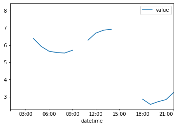


Jetzt füllen wir die Werte mit vier unterschiedliche methoden:

Alle leere Werte mit 0 füllen


```python
parse(path = filepath, fix_time_stamps= True, get_meta = False, fill_missing_values='0', plot=True)
```


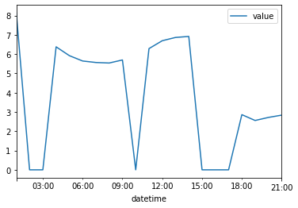


Mit dem vorherigen Wert


```python
parse(path = filepath, fix_time_stamps= True, get_meta = False, fill_missing_values='fill_values_forward', plot=True)
```


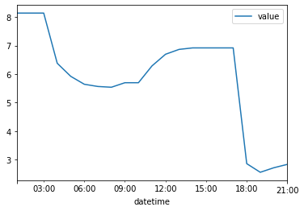


Mit dem nächten Wert


```python
parse(path = filepath, fix_time_stamps= True, get_meta = False, fill_missing_values='fill_values_backward', plot=True)
```


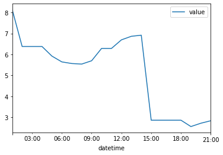


Interpolieren


```python
parse(path = filepath, fix_time_stamps= True, get_meta = False, fill_missing_values='interpolate', plot=True)
```


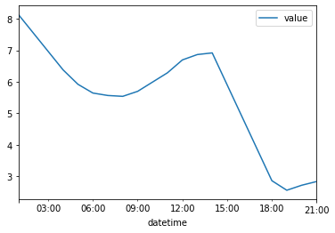


### 3. 3. Sommer-/ Winterzeitumstellung überprüfen und ggf. korrigieren

* Winterzeit: Im letzten Sonntag in Oktober wird die Uhr um 3:00 auf 2:00 zurückgestellt.
* Sommerzeit: Im letzten Sonntag in März wird der Uhr um 2:00 auf 3:00 vorgestellt.
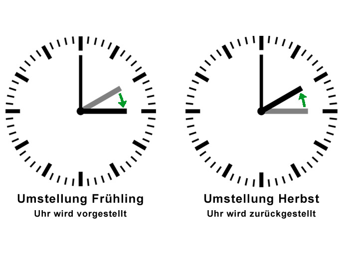

#### 3. 3. 1. Beginn- und Ende-Konvention

Beispiel1: Stündliche Zeitreihen

<tr><td>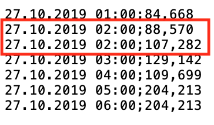</td><td>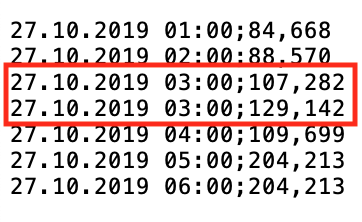</td></tr>

Beispiel2: Viertelstündliche Zeitreihen

<tr><td>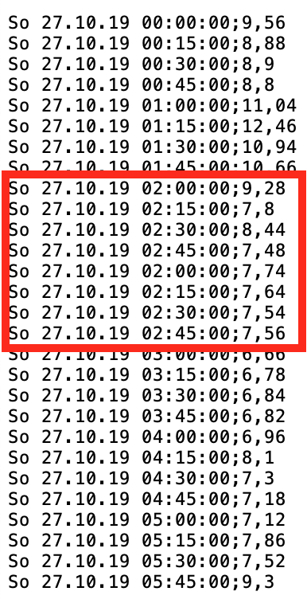</td><td>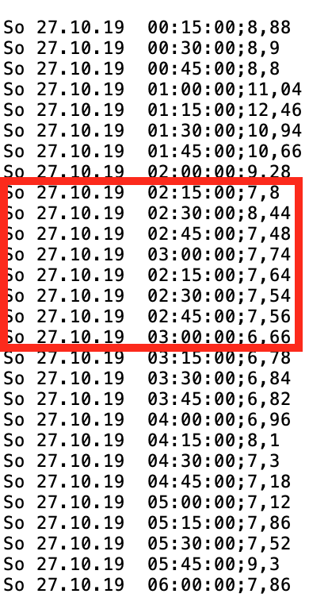</td></tr>

#### 3. 3. 1. Beispiel für Korrektur der Zeitumstellung


```python
filepath = "assets/csv/sum_begin_q .csv"
df = pd.read_csv(filepath, header=None, delimiter=';')
df.head(15)
```


<div>
<table border="1" class="dataframe">
  <thead>
    <tr style="text-align: right;">
      <th></th>
      <th>0</th>
      <th>1</th>
    </tr>
  </thead>
  <tbody>
    <tr>
      <td>0</td>
      <td>So 31.03.19  00:00:00</td>
      <td>22,33</td>
    </tr>
    <tr>
      <td>1</td>
      <td>So 31.03.19  00:15:00</td>
      <td>23,59</td>
    </tr>
    <tr>
      <td>2</td>
      <td>So 31.03.19  00:30:00</td>
      <td>0,32</td>
    </tr>
    <tr>
      <td>3</td>
      <td>So 31.03.19  00:45:00</td>
      <td>22,27</td>
    </tr>
    <tr>
      <td>4</td>
      <td>So 31.03.19  01:00:00</td>
      <td>21,33</td>
    </tr>
    <tr>
      <td>5</td>
      <td>So 31.03.19  01:15:00</td>
      <td>22,55</td>
    </tr>
    <tr>
      <td>6</td>
      <td>So 31.03.19  01:30:00</td>
      <td>21,95</td>
    </tr>
    <tr>
      <td>7</td>
      <td>So 31.03.19  01:45:00</td>
      <td>20,69</td>
    </tr>
    <tr>
      <td>8</td>
      <td>So 31.03.19  02:00:00</td>
      <td>0</td>
    </tr>
    <tr>
      <td>9</td>
      <td>So 31.03.19  02:15:00</td>
      <td>0</td>
    </tr>
    <tr>
      <td>10</td>
      <td>So 31.03.19  02:30:00</td>
      <td>0</td>
    </tr>
    <tr>
      <td>11</td>
      <td>So 31.03.19  02:45:00</td>
      <td>0</td>
    </tr>
    <tr>
      <td>12</td>
      <td>So 31.03.19  03:00:00</td>
      <td>20,75</td>
    </tr>
    <tr>
      <td>13</td>
      <td>So 31.03.19  03:15:00</td>
      <td>20,81</td>
    </tr>
    <tr>
      <td>14</td>
      <td>So 31.03.19  03:30:00</td>
      <td>20,45</td>
    </tr>
  </tbody>
</table>
</div>


```python
parse(path = filepath, fix_time_stamps= True, get_meta = False)
```

                  datetime  value
    0  2019-03-31 00:00:00  22.33
    1  2019-03-31 00:15:00  23.59
    2  2019-03-31 00:30:00   0.32
    3  2019-03-31 00:45:00  22.27
    4  2019-03-31 01:00:00  21.33
    5  2019-03-31 01:15:00  22.55
    6  2019-03-31 01:30:00  21.95
    7  2019-03-31 01:45:00  20.69
    8  2019-03-31 03:00:00  20.75
    9  2019-03-31 03:15:00  20.81
    10 2019-03-31 03:30:00  20.45
    11 2019-03-31 03:45:00  21.17
    12 2019-03-31 04:00:00  21.45
    13 2019-03-31 04:15:00  21.83
    14 2019-03-31 04:30:00  21.67


```python
filepath = "assets/csv/sum_end_q.csv"
df = pd.read_csv(filepath, header=None, delimiter=';')
df.head(15)
```


<div>
<table border="1" class="dataframe">
  <thead>
    <tr style="text-align: right;">
      <th></th>
      <th>0</th>
      <th>1</th>
    </tr>
  </thead>
  <tbody>
    <tr>
      <td>0</td>
      <td>So 31.03.19  00:00:00</td>
      <td>22,33</td>
    </tr>
    <tr>
      <td>1</td>
      <td>So 31.03.19  00:15:00</td>
      <td>23,59</td>
    </tr>
    <tr>
      <td>2</td>
      <td>So 31.03.19  00:30:00</td>
      <td>0,32</td>
    </tr>
    <tr>
      <td>3</td>
      <td>So 31.03.19  00:45:00</td>
      <td>22,27</td>
    </tr>
    <tr>
      <td>4</td>
      <td>So 31.03.19  01:00:00</td>
      <td>21,33</td>
    </tr>
    <tr>
      <td>5</td>
      <td>So 31.03.19  01:15:00</td>
      <td>22,55</td>
    </tr>
    <tr>
      <td>6</td>
      <td>So 31.03.19  01:30:00</td>
      <td>21,95</td>
    </tr>
    <tr>
      <td>7</td>
      <td>So 31.03.19  01:45:00</td>
      <td>20,69</td>
    </tr>
    <tr>
      <td>8</td>
      <td>So 31.03.19  02:00:00</td>
      <td>20,75</td>
    </tr>
    <tr>
      <td>9</td>
      <td>So 31.03.19  02:15:00</td>
      <td>0</td>
    </tr>
    <tr>
      <td>10</td>
      <td>So 31.03.19  02:30:00</td>
      <td>0</td>
    </tr>
    <tr>
      <td>11</td>
      <td>So 31.03.19  02:45:00</td>
      <td>0</td>
    </tr>
    <tr>
      <td>12</td>
      <td>So 31.03.19  03:00:00</td>
      <td>0</td>
    </tr>
    <tr>
      <td>13</td>
      <td>So 31.03.19  03:15:00</td>
      <td>20,81</td>
    </tr>
    <tr>
      <td>14</td>
      <td>So 31.03.19  03:30:00</td>
      <td>20,45</td>
    </tr>
  </tbody>
</table>
</div>


```python
parse(path = filepath, fix_time_stamps= True, get_meta = False)
```

                  datetime  value
    0  2019-03-31 00:00:00  22.33
    1  2019-03-31 00:15:00  23.59
    2  2019-03-31 00:30:00   0.32
    3  2019-03-31 00:45:00  22.27
    4  2019-03-31 01:00:00  21.33
    5  2019-03-31 01:15:00  22.55
    6  2019-03-31 01:30:00  21.95
    7  2019-03-31 01:45:00  20.69
    8  2019-03-31 02:00:00  20.75
    9  2019-03-31 03:15:00  20.81
    10 2019-03-31 03:30:00  20.45
    11 2019-03-31 03:45:00  21.17
    12 2019-03-31 04:00:00  21.45
    13 2019-03-31 04:15:00  21.83
    14 2019-03-31 04:30:00  21.67

